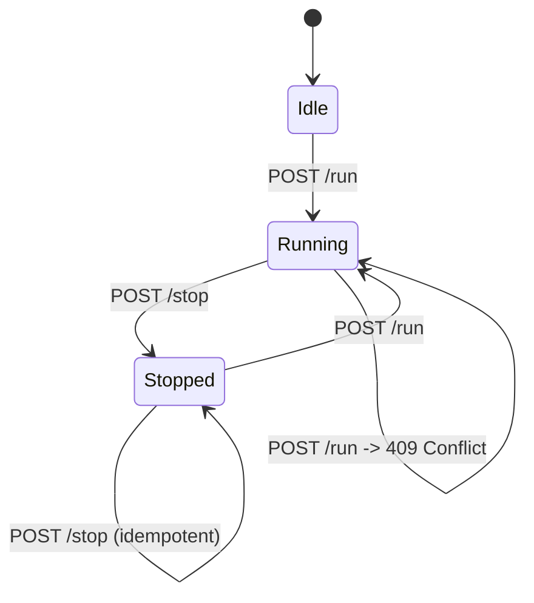

# RobotStopApp API Documentation for Client Teams

## 1. Purpose
RobotStopApp is a server-side REST API used to control robot execution state from client applications.

Current version supports:
- Start robot run command
- Stop robot command
- Read current robot status
- Health probe

## 2. Environment and Base URL
Default local development URL:
- http://localhost:5188

If HTTPS profile is used:
- https://localhost:7049

## 3. Authentication
Robot command endpoints require API key authentication.

Header required:
- X-Api-Key: <your_api_key>

API key source on server:
- Environment variable ROBOTSTOPAPP_APIKEY (recommended)
- Fallback: ApiKey in appsettings.json

If API key is missing or invalid, API returns 401 Unauthorized.

## 4. Endpoint Summary
| Method | Path | Auth Required | Description |
|---|---|---|---|
| POST | /api/robot/run | Yes | Start robot execution |
| POST | /api/robot/stop | Yes | Stop robot execution (idempotent) |
| GET | /api/robot/status | Yes | Get current robot state |
| GET | /health | No | Server health endpoint |

## 5. Data Contracts
### 5.1 RobotStateResponse
```json
{
  "state": "Running",
  "timestamp": "2026-05-29T10:30:00.0000000+00:00"
}
```

Fields:
- state: one of Idle, Running, Stopped, Faulted
- timestamp: UTC ISO-8601 timestamp generated by server

### 5.2 ErrorResponse
```json
{
  "error": "InvalidTransition",
  "detail": "Cannot run robot while in state 'Running'."
}
```

Fields:
- error: error code string
- detail: additional context (may be null)

## 6. Endpoint Details
### 6.1 POST /api/robot/run
Starts robot execution.

Request body:
- none

Success response:
- 200 OK with RobotStateResponse

Error responses:
- 401 Unauthorized: API key missing/invalid
- 409 Conflict: robot is already Running
- 500 Internal Server Error: unhandled server error

Example:
```bash
curl -X POST "http://localhost:5188/api/robot/run" \
  -H "X-Api-Key: dev-local-key-change-me"
```

### 6.2 POST /api/robot/stop
Stops robot execution.

Request body:
- none

Success response:
- 200 OK with RobotStateResponse

Behavior note:
- idempotent stop: calling stop while already Stopped still returns 200 OK with state Stopped

Error responses:
- 401 Unauthorized: API key missing/invalid
- 500 Internal Server Error: unhandled server error

Example:
```bash
curl -X POST "http://localhost:5188/api/robot/stop" \
  -H "X-Api-Key: dev-local-key-change-me"
```

### 6.3 GET /api/robot/status
Returns current robot state.

Success response:
- 200 OK with RobotStateResponse

Error responses:
- 401 Unauthorized: API key missing/invalid
- 500 Internal Server Error: unhandled server error

Example:
```bash
curl "http://localhost:5188/api/robot/status" \
  -H "X-Api-Key: dev-local-key-change-me"
```

### 6.4 GET /health
Simple service health endpoint.

Success response:
- 200 OK

No authentication required.

## 7. State Transition Rules


## 8. Client Integration Guidance
- Treat 401 as authentication/configuration issue (header missing, wrong key, or server key not configured).
- Treat 409 on run as a business-state conflict; do not retry immediately without checking status.
- On network timeout or 5xx, retry with backoff if your workflow tolerates duplicates.
- Use GET /api/robot/status to confirm final state after command calls.

## 9. Testing from Swagger
In Development environment, open:
- /swagger

Use Authorize and set:
- X-Api-Key value

Then test run/stop/status directly from UI.

## 10. Current Implementation Scope
Important for client teams:
- Robot control layer is currently a stubbed in-memory controller.
- API contract is stable for integration, but hardware-level behavior will be connected later via real robot driver.
