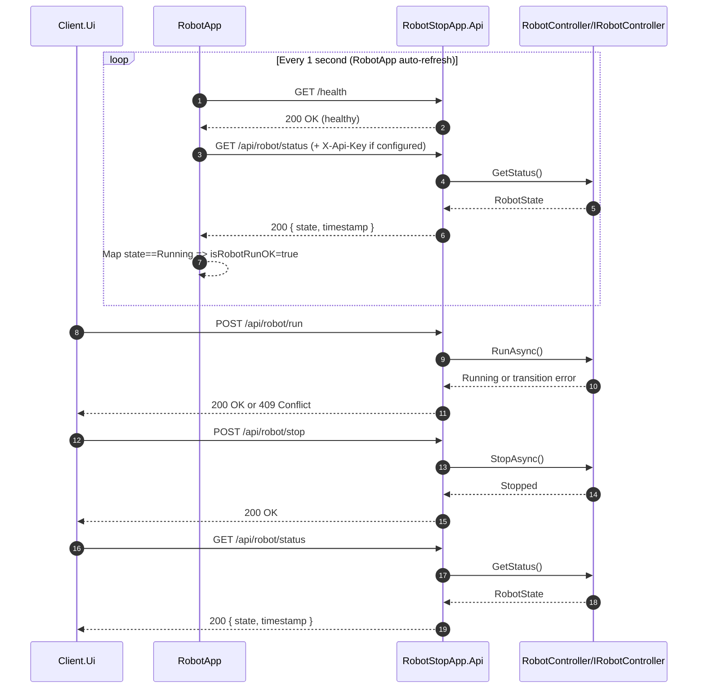

# RobotStopApp

Robot control solution with a reusable service DLL, an HTTP API host, and two Avalonia desktop consumers:

- `RobotApp`: lightweight status monitor (`API connected`, `isRobotRunOK`) with auto-refresh every 1 second.
- `Client.Ui`: richer API test console for run/stop/status actions and request logs.

## Project Layout

- `src/RobotStopApp.Service`: shared contracts and models.
- `src/RobotStopApp.Api`: ASP.NET Core API host.
- `src/RobotStopApp.RobotApp`: simple status-oriented desktop app.
- `src/RobotStopApp.Client.Ui`: richer desktop API client.
- `tests/*`: unit/integration test projects.

## Usage

### Option 1: VS Code (Recommended)

Use Run and Debug with these profiles:

- `All Apps (API + RobotApp + Client.Ui)`
- `Full Stack (API + RobotApp)`
- `Full Stack (API + Client.Ui)`

These profiles are defined in `.vscode/launch.json`.

### Option 2: CLI

From repository root, start apps in separate terminals:

```powershell
dotnet run --project src/RobotStopApp.Api
dotnet run --project src/RobotStopApp.RobotApp
dotnet run --project src/RobotStopApp.Client.Ui
```

## API Endpoints

| Method | Path                | Description                        |
| ------ | ------------------- | ---------------------------------- |
| POST   | `/api/robot/run`    | Start robot (409 if invalid transition). |
| POST   | `/api/robot/stop`   | Stop robot (idempotent).           |
| GET    | `/api/robot/status` | Get current robot state.           |
| GET    | `/health`           | Health probe.                      |
| GET    | `/swagger`          | Swagger UI (Development only).     |

Current controller is configured with `[AllowAnonymous]`, so robot endpoints are currently open.

Note: API key plumbing still exists in the API and clients (`X-Api-Key` header), so you can re-enable controller authorization later without changing client request code.

## Request Flow Diagram



## Critical Code Paths

### API Implementation

- Endpoint controller: `src/RobotStopApp.Api/Controllers/RobotController.cs`
- Robot state response model: `src/RobotStopApp.Service/Models/RobotStateResponse.cs`
- Robot state enum: `src/RobotStopApp.Service/Robot/RobotState.cs`

### How `RobotApp` Uses the API

1. Loads settings from `src/RobotStopApp.RobotApp/appsettings.json` (`RobotApp:ApiBaseUrl`, `RobotApp:ApiKey`).
2. DI setup in `src/RobotStopApp.RobotApp/App.axaml.cs` registers `IRobotStatusService` -> `HttpRobotStatusService`.
3. API call implementation in `src/RobotStopApp.RobotApp/Services/HttpRobotStatusService.cs`:
	- Calls `GET /health` for connectivity.
	- Calls `GET /api/robot/status` for robot state.
	- Maps `RobotState.Running` to `IsRobotRunOk = true`.
	- Handles both numeric and string enum JSON values.
4. UI projection in `src/RobotStopApp.RobotApp/ViewModels/MainWindowViewModel.cs`:
	- Assigns `IsRobotRunOk` from service result.
	- Exposes `IsRobotRunOkText` and `IsRobotRunOkBrush` for bindings.
	- Runs auto-refresh loop every 1 second via `PeriodicTimer`.
5. UI binding in `src/RobotStopApp.RobotApp/MainWindow.axaml`:
	- `Text="{Binding IsRobotRunOkText}"`
	- `Foreground="{Binding IsRobotRunOkBrush}"`

### How `Client.Ui` Uses the API

1. Loads settings from `src/RobotStopApp.Client.Ui/appsettings.json` (`ApiClient:BaseUrl`, `ApiClient:ApiKey`).
2. DI setup in `src/RobotStopApp.Client.Ui/App.axaml.cs` registers `IRobotApiClient` -> `RobotApiClient`.
3. API call implementation in `src/RobotStopApp.Client.Ui/Services/RobotApiClient.cs`:
	- `RunAsync` -> `POST /api/robot/run`
	- `StopAsync` -> `POST /api/robot/stop`
	- `StatusAsync` -> `GET /api/robot/status`
	- Parses `state` and `timestamp` from response payload.
	- Handles both numeric and string enum `state` values.
4. UI orchestration in `src/RobotStopApp.Client.Ui/ViewModels/MainWindowViewModel.cs`:
	- Exposes commands (`RunCommand`, `StopCommand`, `StatusCommand`, `CancelCommand`).
	- Maps API results to `StateLabel`, `StateBrush`, `StatusMessage`, `TimestampText`, and request log.

## Build and Test

```powershell
dotnet build RobotStopApp.sln -c Debug
dotnet test RobotStopApp.sln -c Debug
```

## Notes

- If you re-enable API authorization, ensure clients send the same key as the API expects.
- If a build fails with file-lock errors, stop running app/debug sessions first, then rebuild.

